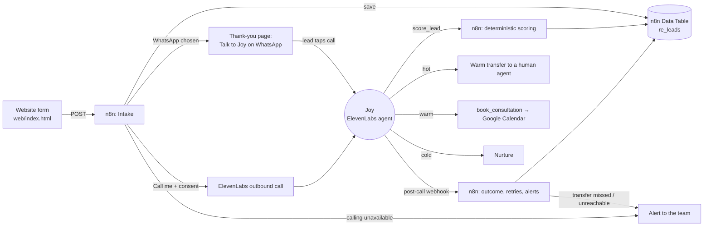

# Oriki Homes: AI speed-to-lead for Nigerian real estate

An AI voice agent, **Joy**, answers every property enquiry in under a minute. She qualifies the buyer and then routes them: a hot lead goes live to a human agent, a warm lead gets an inspection booked, and a cold lead goes to nurture. Every step is logged.

Built with **ElevenLabs Agents** (voice), **n8n** (workflows and data) and **WhatsApp** for a fictional Lagos/Abuja developer, Oriki Homes.

> Status: prototype. The n8n workflows are live and tested with sample leads. Joy exists in ElevenLabs with her tools connected to n8n. The WhatsApp line and phone calling are not connected yet. See [docs/project-kickoff.md](docs/project-kickoff.md) for the brief, decisions and proof checks.

## Why

- Leads contacted within 5 minutes are about **100× more likely to be reached** and **21× more likely to qualify** than leads contacted after 30 minutes (MIT/InsideSales, 15,000+ leads).
- Many companies take hours or days to respond, and nobody answers at 2am. Diaspora buyers are often awake exactly then.
- In Nigeria, buyers live on **WhatsApp**, pay on **installment plans**, and worry most about **title documents** and **fraud**. The agent is designed around all three.

## How it works



1. **Enquiry.** The lead picks WhatsApp (the default, and free) or "Call me". A phone call needs explicit consent.
2. **First contact in under 60 seconds.** Either the lead taps *Talk to Joy on WhatsApp* and calls her, or Joy phones them.
3. **Qualification.** Joy asks one question at a time: land or house, location, budget in naira, outright or payment plan, timeline, Nigeria or diaspora, who else decides.
4. **Scoring is code, not vibes.** Joy passes the answers to `score_lead`, and a tested, deterministic function returns the tier and the next step. The same answers always get the same tier, and every score stores its reasons.
5. **Routing.**
   - **Hot:** live transfer to a human with a spoken summary.
   - **Warm:** site inspection or diaspora video inspection booked on the calendar.
   - **Cold:** nurture.
6. **Afterwards.** The post-call webhook records the outcome and transcript, retries unanswered calls (3 attempts, 5 minutes apart), and alerts the team when a hot transfer is missed or calling is down.

**Guardrails:**
- Joy says she's an AI.
- She never takes payment or guarantees a title or return.
- She honours "stop calling me" (the lead is marked do-not-call).
- Direct callers without a form are matched by phone number or created as new leads.

## Repo layout

| Path | What it is |
|---|---|
| `web/index.html` | Oriki Homes landing page and enquiry form (single file, no build) |
| `web/img/` | AI-generated property images; see `docs/image-prompts.md` (no real homes are shown) |
| `agent/system-prompt.md` | Joy's prompt |
| `agent/scoring.js` + `scoring.test.js` | Lead scoring rubric and its tests |
| `scripts/setup-elevenlabs.mjs` | Builds the ElevenLabs tool and agent payloads (`--dry-run` prints them) |
| `scripts/create-agent.py` | Creates or updates Joy and her tools in ElevenLabs (ids in `agent/deployed.json`) |
| `scripts/build-n8n.mjs` | Generates both n8n workflows from `n8n/config.json` into `n8n/build/` |
| `scripts/deploy-n8n.py` | Creates or updates the workflows in n8n and activates them |
| `n8n/config.example.json` | Config template (brand, ids, credentials, WhatsApp) |
| `docs/project-kickoff.md` | Goal, six-P brief, decision log, build status and proof checks |

## Setup

Requirements: Node 18+, Python 3, an n8n instance, an ElevenLabs account, and a Meta WhatsApp Cloud API number (a SIM that isn't on WhatsApp).

```bash
cp n8n/config.example.json n8n/config.json   # fill in ids, credential ids, BUSINESS_WHATSAPP
node agent/scoring.test.js                   # scoring tests
node scripts/build-n8n.mjs                   # generate workflows into n8n/build/
python3 scripts/deploy-n8n.py                # push + activate (needs N8N_API_KEY in .env)
python3 scripts/create-agent.py              # create/update Joy + tools (needs ELEVENLABS_API_KEY)
```

Create a `.env` file (git-ignored) containing `N8N_API_KEY`, `ELEVENLABS_API_KEY` and `TRANSFER_NUMBER`. Add `BUSINESS_WHATSAPP`, `WHATSAPP_PHONE_NUMBER_ID` and `WHATSAPP_ACCESS_TOKEN` once WhatsApp is set up.

Create the n8n Data Table `re_leads` with the columns listed in the brief's setup runbook.

In ElevenLabs:
- Point the workspace post-call webhook at `<n8n>/webhook/re-elevenlabs-postcall`.
- Import the WhatsApp number (Agents → WhatsApp → Import Account) and assign Joy to it.

To preview the landing page locally:

```bash
python3 -m http.server 8765 --directory web
```

## Compliance notes

- **US calls (TCPA):** in February 2024 the US FCC ruled that AI voices count as "artificial voice", so an outbound AI call needs prior express consent. This build only phones leads who ticked consent, and it stores the consent text.
- **WhatsApp:** Meta requires the user's permission before a business can call them. The main path avoids this, because the lead calls Joy themselves.

Oriki Homes, its estates and prices are **fictional**. This is a portfolio demonstration.
